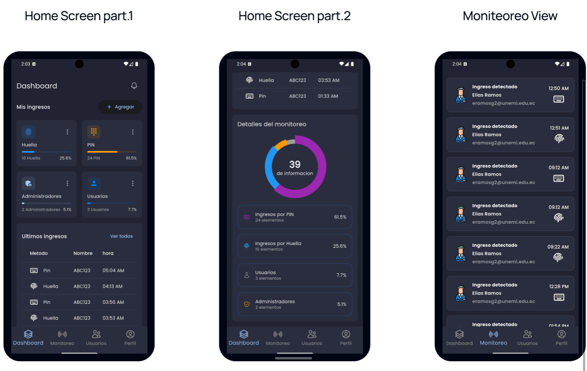
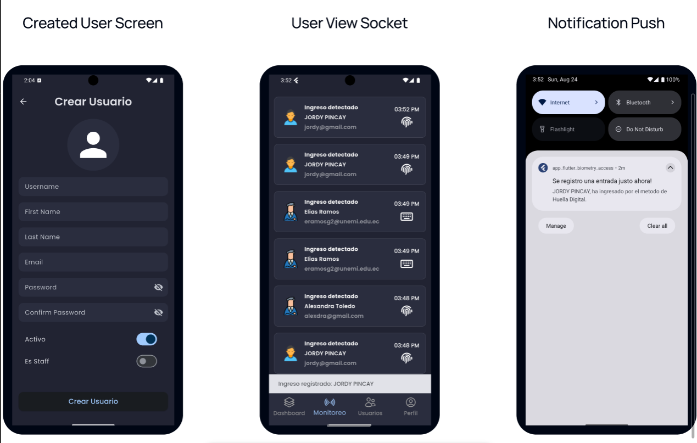

<<<<<<< HEAD

# Real-Time Access Monitoring App (Flutter)

This project is a real-time access monitoring application built with Flutter. It features biometric authentication, user management, and push notifications using Firebase. Originally developed as a university project, it provides a functional solution for security control and entry management.

## Features
- Real-time access monitoring
- Biometric authentication for secure logins
- User registration and management
- Push notifications via Firebase Cloud Messaging
- Modern UI with custom themes and icons


## Screenshots
<!-- Add screenshots here if available -->



## Getting Started

### Prerequisites
- [Flutter SDK](https://flutter.dev/docs/get-started/install)
- Dart SDK (included with Flutter)
- Android Studio or Xcode (for mobile development)
- Firebase project (for push notifications)

### Installation
1. Clone this repository:
   ```sh
   git clone https://github.com/eliasDniel/APP_FLUTTER_MONITOREO_TIEMPO_REAL.git
   cd app_flutter_monitoreo_tiempo_real
   ```
2. Install dependencies:
   ```sh
   flutter pub get
   ```
3. Configure Firebase:
   - Add your `google-services.json` (Android) and `GoogleService-Info.plist` (iOS) files to the respective directories.
   - Update `firebase_options.dart` if needed.
4. Run the app:
   ```sh
   flutter run
   ```

## Project Structure

```
lib/
  firebase_options.dart
  main.dart
  config/         # App configuration (constants, helpers, router, theme)
  domain/         # Domain entities
  infrastructure/ # Data models
  presentation/   # UI (blocs, providers, screens, widgets)
assets/
  icons/
  images/
```

## Main Dependencies
- flutter_bloc
- provider
- firebase_core
- firebase_messaging
- dio
- go_router
- animate_do
- fl_chart
- google_fonts
- heroicons
- intl
- web_socket_channel

See `pubspec.yaml` for the full list.

## License
This project is for educational purposes. Please check with the author for commercial use.
